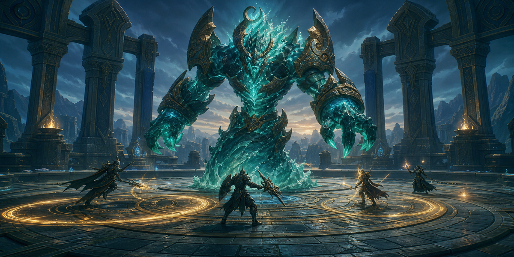

# S-Tier Blizz Settings

Лёгкий аддон для WoW Retail, который выставляет проверенный баланс FPS, качества картинки и читаемости боя — только через стандартные настройки Blizzard.

> Это реальный кадр из игры. Конкретный вид и FPS зависят от компьютера, локации и игровой ситуации.

## Установка

1. Скачайте [STierBlizzSettings-v0.4.20-alpha.zip](https://github.com/znoynext/STierBlizzSettings/raw/refs/heads/main/dist/STierBlizzSettings-v0.4.20-alpha.zip).
2. Распакуйте архив в `World of Warcraft/_retail_/Interface/AddOns/`.
3. Проверьте путь: `.../AddOns/STierBlizzSettings/STierBlizzSettings.toc`.
4. Включите аддон и откройте его командой `/stier` или кнопкой у миникарты.

## Что работает

- Пять понятных основных вкладок: **Графика**, **UI Tweaks**, **Тест FPS**, **Профили** и **Об аддоне**. Внутри «Графики» находятся подразделы **Настройки графики** и **Переключение по зонам**.
- **UI Tweaks** содержит только проверенные CVar актуального Retail: рекомендуемую резкость/свечение, дополнительные эффекты смерти/мира духов и максимальное отдаление камеры. Раздел работает автономно: графические пресеты никогда не меняют его значения. Есть чекбоксы, ползунок, краткие подсказки, отдельный бэкап и возврат назад.
- Три пресета: **PRO** для максимального практического FPS, **Оптимальный** для рекомендуемого баланса и **Качество** для лучшей картинки без бесполезных максимумов.
- Необязательные пресеты для мира/городов, подземелий, рейдов, PvP/арен и сценариев/вылазок. Они изначально выключены; автоматическая проверка выполняется после входа в мир или смены зоны, а применение происходит только при реальном изменении настроек.
- Один понятный активный пресет; вся логика переключения по типу контента находится только в Zone Graphics.
- Краткий предпросмотр результата без технического списка CVar и отдельное подтверждение перед применением.
- Транзакционное применение с автоматическим бэкапом и проверкой результата для реальных изменений. Уже активные настройки возвращают `unchanged` без нового бэкапа или записи в истории транзакций.
- Восстановление бэкапа отдельно сообщает отложенный, полный, частичный и недоступный результат. Совместимые legacy-настройки безопасно восстанавливаются, даже если другая сохранённая CVar была удалена или недоступна, а recovery-записи после сбоя не удаляются даже при минимальном лимите истории.
- Выбор графического пресета остаётся черновиком до успешного применения. Отложенные из-за боя Graphics, Zone Graphics, UI Tweaks и восстановление завершаются единым проверенным процессом: ошибка, отмена или откат не меняют фактически применённые пресет и режим.
- Кнопка **«Вернуть назад»** восстанавливает последнее сохранившееся пользовательское изменение графики и пропускает автоматические Zone Graphics, временные FPS-бэкапы и safety-бэкапы восстановления.
- Дашборд из четырёх карточек с текущим FPS и цветными результатами «до», «после» и «изменение». После немедленного применения пресета открывается плавный прогресс замера на 5 секунд, а затем аддон сам предлагает Reload UI. Если применение отложено из-за боя, устаревшее сравнение пропускается с понятным сообщением; для свежего замера остаётся доступен «Тест FPS». Отдельный раздел содержит отменяемый тест на 20 секунд, объяснение стабильности и наглядное сравнение текущей графики с пресетами. Если средний FPS и 1% Low выросли минимум на 5%, протестированный пресет можно сразу применить с подтверждением и новым бэкапом.
- Необязательный компактный индикатор FPS и реального пинга Home/World внизу экрана с цветом от красного до зелёного.
- В разделе «Профили» есть отдельные представления для личных профилей, истории бэкапов и импорта/экспорта. `STBSA1` переносит графику, доступные UI Tweaks, проверенные применённые пресет/режим, состояние индикатора, правила зон и личные профили; история, runtime-черновик и экранные позиции не экспортируются, а импорт сохраняет локальную раскладку окна, виджета и миникарты вместе с другими настройками этого устройства. Старые bundle со снятым с поддержки benchmark mode остаются совместимыми, а это поле безопасно игнорируется.
- Применение, переименование, экспорт и удаление профилей; восстановление и удаление бэкапов. Старые раздельные профили для рейдов и полей боя явно помечаются: преобразование сохраняет новую единую копию, не меняя текущую графику и не удаляя исходник, а точное применение старого split-режима остаётся расширенным действием с бэкапом.
- Детерминированный экспорт профиля `STBS1:` и безопасный data-only importer. Импортер реализован в коде, но сейчас не имеет кнопки в разделе «Профили»; видимый экран переноса открывает только полный импорт `STBSA1`. Код из импорта не выполняется.
- Явный цветной результат после сохранения, бэкапа, удаления, восстановления и применения.
- Золотая иконка `S` у миникарты, увеличенные стандартные шрифты WoW, масштабируемые кнопки и собственные модальные окна в стиле аддона: тёмные поверхности, золотые состояния, плавный отклик и красный цвет только для опасных действий.
- В шапке крупным стандартным шрифтом аддона показан текущий пресет: **PRO**, **Оптимальный**, **Качество** или **Custom** после ручных изменений.

Аддон оптимизирует все независимые пункты активного набора **Graphics Quality**, а также безопасные пункты **Graphics** и **Advanced**. Монитор, разрешение, Render Scale, V-Sync, API, видеокарта, лимиты FPS, цвет и режим задержки намеренно сохраняются: они зависят от оборудования или личных предпочтений. Полная матрица покрытия находится в [исследовании пресетов](docs/RECOMMENDED_PROFILE_RESEARCH.md).

**Раздел «Интерфейс и игра» временно скрыт на время переработки.** Внутренняя совместимость со старыми данными сохранена.

## Как считается FPS

Пока окно графики открыто, аддон показывает Retail `GetFramerate()` в реальном времени и при немедленном применении сравнивает текущую сцену с пятью секундами после него. Если операция ждала окончания боя, старый baseline удаляется, а автоматическое сравнение пропускается, чтобы не сопоставлять разные сцены. Отдельная вкладка «Тест FPS» остаётся доступной, записывает каждый кадр 20 секунд и показывает средний FPS, 1% Low по худшему 1% времени кадров, стабильность, заметные скачки и время худшего кадра. Сравнение пресета делает два реальных 20-секундных замера, временно применяет выбранный пресет через транзакцию с бэкапом и автоматически возвращает исходную графику. После проверенного восстановления временные бэкапы сессии удаляются, поэтому история пользователя не меняется; при ошибке данные для восстановления сохраняются. Это локальная оценка, поэтому не меняйте ракурс и нагрузку.

## Безопасность и статус

Нет телеметрии, сети, рекламы, платных функций, донатов и автоматизации геймплея. Настройки проверяются по актуальным исходникам интерфейса Blizzard Retail; недоступные значения не применяются.

Текущая версия: **0.4.20-alpha**. Базовая совместимость: Retail 12.0.7, Interface 120007, Blizzard UI build 68453. До production v1.0 требуется визуальная проверка в живом клиенте и контролируемые аппаратные бенчмарки.

Подробнее: [текущее состояние проекта](docs/PROJECT_STATE.md), [исследование пресетов](docs/RECOMMENDED_PROFILE_RESEARCH.md), [архитектура](docs/ARCHITECTURE.md), [заметки UI/UX](docs/UI_UX_RESEARCH.md) и [план тестирования](docs/TEST_PLAN.md).
